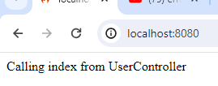

# Build 
- for initila setup `composer create-project codeigniter4/appstarter meramerchattest`
- for change the environment settings `.env`
    - change the deployment environment from production to development `CI_ENVIRONMENT = development`
    - change the base url `app_baseURL = 'http://localhost:8080/'`
    - change the database settings as below 
    ```
    database.default.hostname = 'mnserviceproviders.com'
    database.default.database = 'build_mminvoice_flow'
    database.default.username = 'build_usr_mminvoice_flow'
    database.default.password = '0945m^FJiL'
    database.default.DBDriver = MySQLi
    database.default.DBPrefix =
    database.default.port = '3307'
    ```
 - make the directory re-writable mode `writable`.

 - run migrations `php spark migrate`
 - run migrations.php to alter the tables and to check file exists `php Migrations.php` 

# Test

# Check index url 
- Call the url `http://localhost:8080`  And you must get the below result

***Result***




- Test Api 
- Call the url `http://localhost:8080/test` And you must get the below result

***Result***


# Main API 

# Register User 
    - Call the user `http://localhost:8080/register` 

*** inputs ***
{
    "email":"john.js015@gmail.com",
    "password":"12345",
    "password_confirm":"12345",
    "first_name":"john",
    "last_name":"js",
    "company":"Mnservice provider",
    "phone":"9980952926"
}

*** Result ***


# Login 
    - call the url `http://localhost:8080/login`

*** inputs ***
{
    "email":"sarfraz.sk015@gmail.com",
    "password":"12345"
}

*** Result ***


# Logout  
    - url `http://localhost:8080/logout`

*** inputs ***
Pass token in headers 

*** Result ***


# get user details 
    -url `http://localhost:8080/get_user_data`

*** inputs ***
Pass token - 

*** Result ***


# forgot password 
    -url `http://localhost:8080/forgot_password`

*** inputs ***
{
    "email":"sarfraz.sk015@gmail.com"
}

*** Result ***


# Reset password 
    - url `http://localhost:8080/reset_password`

*** inputs ***
{
    "otp":"1939",
    "new_password":"12",
    "confirm_password":"12"
}

*** Result ***


# generate tester token 
    -url `http://localhost:8080/generate_tester_token`

*** inputs ***
{
    "password_length":"32",
    "alphabets":"false",
    "numbers":"true",
    "symbols":"false"
}

*** Results ***


#########################################################################


1 .  Register api 

http://localhost:8080/register

inputs : 
{
    "email":"sarfu@gmail.com",
    "password":"12345",
    "password_confirm":"12345",
    "first_name":"sarfu",
    "last_name":"shaikh",
    "company":"Sarfu company",
    "phone":"9980950000"
}


#######################################################################

2 . Login api 

http://localhost:8080/login

inputs : 
{
    "email":"sarfraz.sk015@gmail.com",
    "password":"12345"
}

########################################################################

3 .  To get perticular user details 

http://localhost:8080/get_user_data

inputs : 

In headers need to pass token - d93b73e79e65720018a08db1efd6525934ea4272b4667a4c6842a8493a016fc6

###############################################################

4 . logout 

http://localhost:8080/logout

input : 

In headers need to pass token - d93b73e79e65720018a08db1efd6525934ea4272b4667a4c6842a8493a016fc6

##############################################################

5 . forgot password 

http://localhost:8080/forgot_password

input : 

{
    "email":"sarfraz.sk015@gmail.com"
}

This will going to give the OTP on email address.

#####################################################################


6 . Reset password 

http://localhost:8080/reset_password

input : 

{
    "otp":"1472",
    "new_password":"12345",
    "confirm_password":"12345"
}


7 . Generate tester token 

http://localhost:8080/generate_tester_token

input : 

{
    "password_length":"32",
    "alphabets":"false",
    "numbers":"true",
    "symbols":"false"
}


